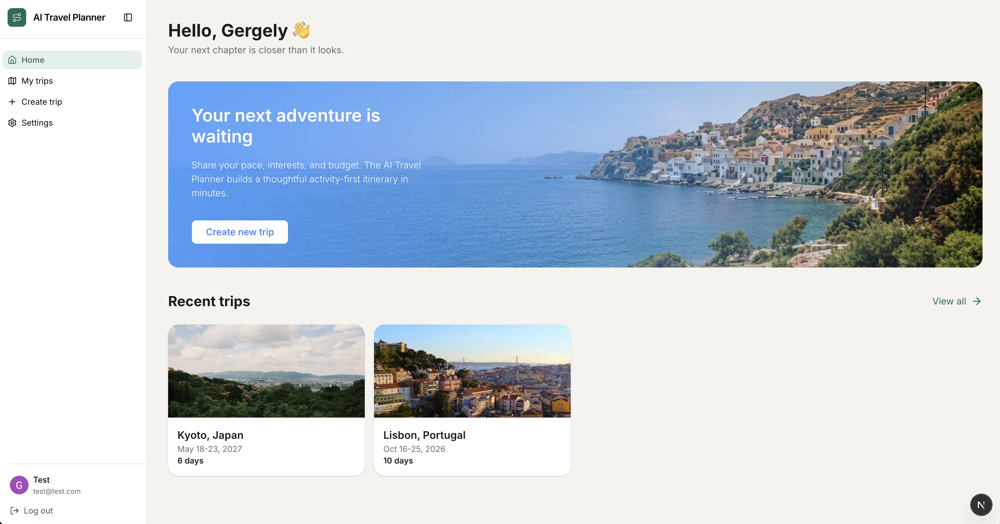
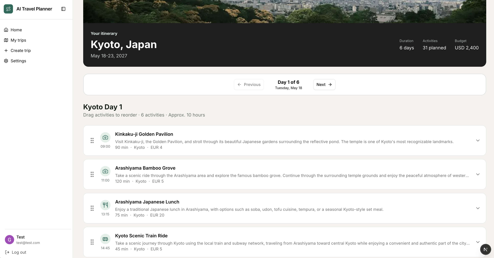
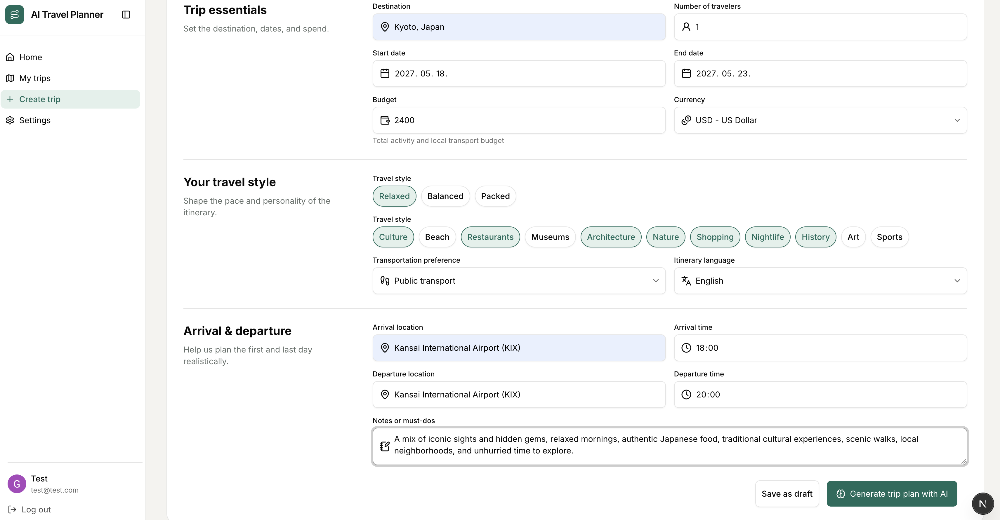
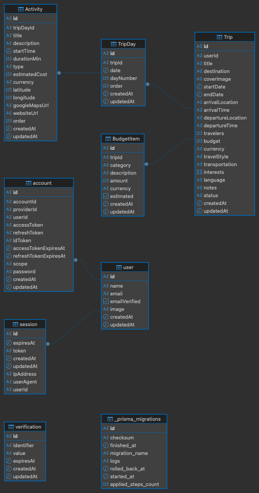

# ✈️ AI Travel Planner - WIP

**Project status:** 🚧 Active development

An AI-powered travel planner that creates personalized day-by-day itineraries based on your destination, dates, budget, travel style, transportation preferences, interests, and other requirements.

The goal is to make trip planning simple by combining AI-generated recommendations with an interactive itinerary.

## ✨ Features

- 🤖 **AI trip generation** based on personal preferences
- 🗺️ **Day-by-day itineraries** with activities, times, locations, and estimated costs
- 💰 **Budget planning** with categorized expenses
- 🎯 **Personalized preferences** including:

  - Travel style
  - Transportation
  - Interests
  - Number of travelers
  - Budget
  - Arrival/departure information
  - Language
  - Additional notes

- 👤 **User authentication and sessions**
- 📍 **Activity locations** with Google Maps and website links
- 🗺️ **Interactive maps** — planned map view showing activity locations directly below the activity details
- 🧭 **Route optimization** — planned feature to calculate an efficient route between activities and optimize the daily itinerary based on location and transportation preferences

## 🧭 How It Works

Users provide their travel preferences, and the AI generates a structured day-by-day itinerary. The generated trip and activities are then validated and enriched with additional information from external APIs, including place details, locations, and images.

```text
User Preferences
       │
       ▼
AI Trip Generation
       │
       ▼
Validation & Enrichment
       │
       ├── Google Places
       ├── Unsplash
       └── Other APIs
       │
       ▼
Structured Itinerary
       │
       ▼
Trip & Activity View
```

## 🖼️ Screenshots







## 🗄️ Database

The application uses **PostgreSQL** with **Prisma ORM**.

The main entities are:

```text
User
 │
 └── Trip
      │
      ├── TripDay
      │    └── Activity
      │
      └── BudgetItem
```

Authentication is handled through `Account`, `Session`, and `Verification` models.

### Database Schema



## 🛠️ Tech Stack

- **Turborepo** — Monorepo management
- **Next.js** — Frontend and web application
- **NestJS** — Backend API
- **PostgreSQL** — Relational database
- **Prisma ORM** — Database access and schema management
- **Better Auth** — Authentication and session management
- **AI** — Personalized trip and itinerary generation
- **Google Places API** — Place information and location data
- **Unsplash API** — Destination and activity imagery

## 🎯 Vision

The long-term goal is to turn AI-generated travel plans into fully interactive itineraries where users can easily modify, rearrange, and optimize their trips instead of simply receiving a static AI-generated plan.

---

## ⚙️ Environment Variables

Create `.env` files for both the API and web applications.

### API

```env
PORT=
DATABASE_URL=

# Better Auth
BETTER_AUTH_SECRET=
BETTER_AUTH_URL=

# Better Auth - OAuth credentials
GOOGLE_CLIENT_ID=
GOOGLE_CLIENT_SECRET=

# Google Places
GOOGLE_PLACES_API_KEY=

# Google Gemini
GEMINI_API_KEY=

# Unsplash
UNSPLASH_ACCESS_KEY=
UNSPLASH_SECRET_KEY=
```

### Web

```env
NEXT_PUBLIC_API_URL=
NEXT_PUBLIC_API_AUTH_URL=
```
